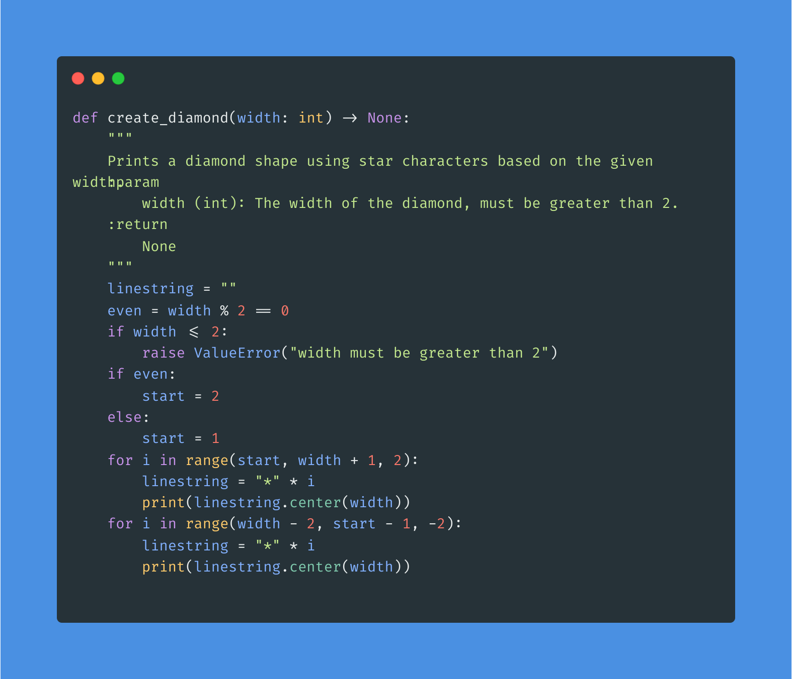

# Challenge: Diamond

Create a diamond shape using the following steps:

Create a function called: "create_diamond()".
This function should take one argument which will be called "width".
"width" will control the total width of the diamond.
Creating a diamond with an even-numbered width can be tricky, so let your creativity handle this part.
The result should look like:


## Solution



### Pytest results

```bash
============================= test session starts ==============================
platform linux -- Python 3.12.7, pytest-8.3.4, pluggy-1.5.0 -- /home/tom/training/challenges/indently/.venv/bin/python3
cachedir: .pytest_cache
rootdir: /home/tom/training/challenges/indently
configfile: pyproject.toml
collecting ... collected 6 items

tests/test_diamond.py::TestCreateDiamond::test_diamond_width_3 PASSED    [ 16%]
tests/test_diamond.py::TestCreateDiamond::test_diamond_width_5 PASSED    [ 33%]
tests/test_diamond.py::TestCreateDiamond::test_diamond_width_6 PASSED    [ 50%]
tests/test_diamond.py::TestCreateDiamond::test_diamond_width_7 PASSED    [ 66%]
tests/test_diamond.py::TestCreateDiamond::test_invalid_negative_width PASSED [ 83%]
tests/test_diamond.py::TestCreateDiamond::test_invalid_width PASSED      [100%]

============================== 6 passed in 0.01s ===============================

```
